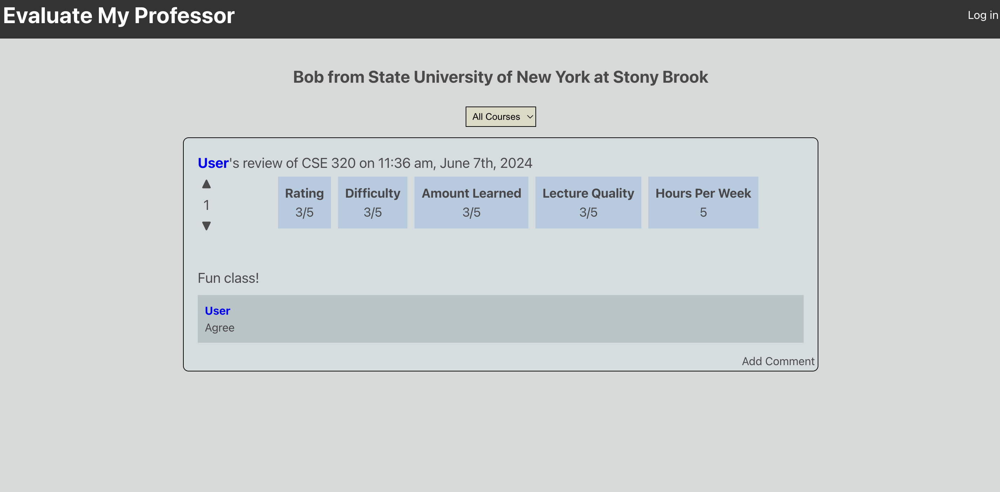

# Evaluate my Professor

A Rate My Professor clone, used for my CSE 300 final project demo.



## Technologies
- [React](https://reactjs.org/)
- [Kotlin](https://kotlinlang.org/)
- [Spring Boot](https://spring.io/projects/spring-boot)
- [MongoDB](https://www.mongodb.com/)

## Installation
- Update the API URLs in `frontend/.env.template` (if necessary) and rename it to `frontend/.env`

- Add a MongoDB connection URI in spring.data.mongodb.uri in `backend/src/main/resources/application.properties.template`. Rename  it to `application.properties`

## Running
To run the frontend:
```shell
cd frontend
npm install
npm run dev
```

To run the backend:
```shell
cd backend
chmod +x gradlew # if permission is denied
./gradlew bootRun
```
